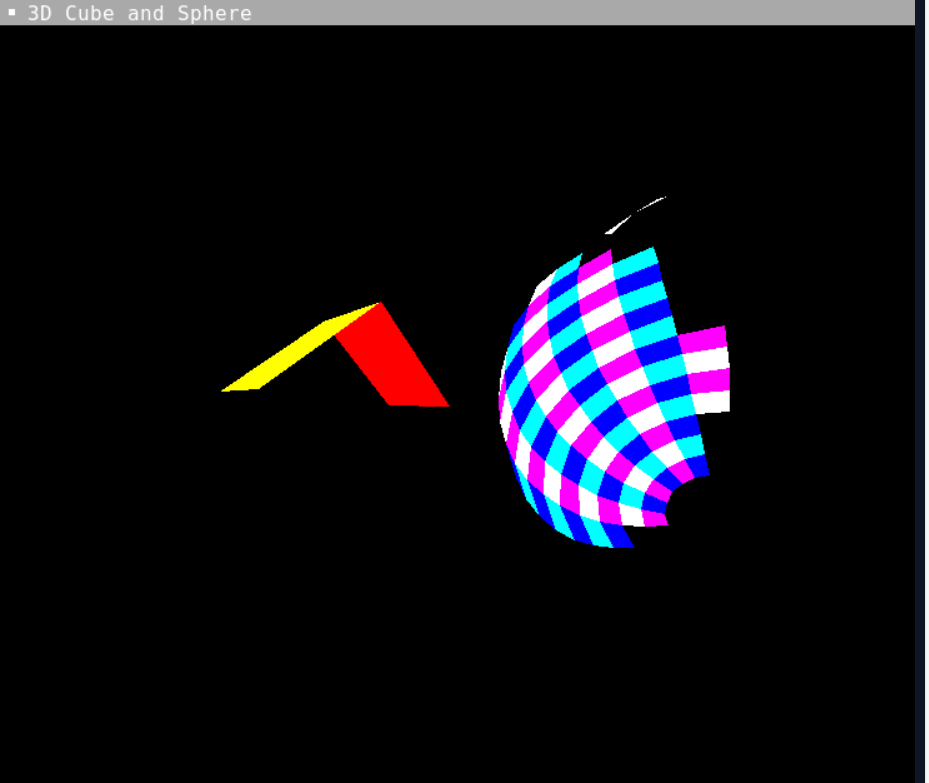

# 3D Engine

This project involves the creation of a basic 3D engine using the SDL2 library. The engine allows for manipulation and display of 3D objects, incorporating interactive control mechanisms.
<div style="display: flex; justify-content: space-between; width: 100%;">
  
  
</div>

## "1. Introduction"

3D rendering is a crucial process in fields such as video games, simulation, and computer-aided design. This project implements a 3D rendering engine using the rasterization technique, which is widely used in real-time interactive applications. The developed engine allows for loading and displaying simple objects, manipulating them through geometric transformations, and handling perspective to display 3D objects on a 2D screen.

## "2. Installation"

### Prerequisites
Make sure you have the following installed on your machine:
- [SDL2](https://libsdl.org/download-2.0.php) - SDL2 is used for window management and rendering graphics.
- [CMake](https://cmake.org/download/) - For project configuration generation.


### Installation on Linux
1. Install SDL2:
   ```bash
   sudo apt-get install libsdl2-dev
   ```
2. Clone this project to your machine:
   ```bash
   git clone https://github.com/Arnaud-YAMEOGO/3D-engine.git
   cd 3D-engine
   ```
3. Compile and Run the program:
   ```bash
   g++ -g -Wall -Wextra -o project *.cpp $(pkg-config --cflags --libs sdl2)
   
   ./project
   ```

### Installation on Windows
1. Download and install SDL2 from the official SDL2 site.
2. Clone this project and compile it using for example CMake.


### Features
- 3D polygon rendering: Displaying triangles and quadrilaterals in 3D.
- Transformations: Support for rotation, translation, and projection of objects.
- Depth handling: Sorting objects by depth to manage occlusion and avoid overlap errors.
- Interactive controls: Manipulating the scene using keyboard and mouse inputs.


The program will display a window containing 3D objects, which you can manipulate in real-time.

### Challenges and Solutions
- **Face Rendering Issues**: Initially, the faces of the objects were displayed only as outlines. This was solved by using the `SDL_RenderGeometryRaw` function from SDL2, which allows for filling polygons.
- **Depth Handling Issues**: When rotating objects, some faces were incorrectly overlapping or disappearing. This was resolved by implementing a depth sorting mechanism for the faces before rendering them on screen.



### Contributors
- **Ahmed TRAORE**
- **Arnaud W. YAMEOGO**


If you want to contribute to this project, feel free to submit a pull request.
